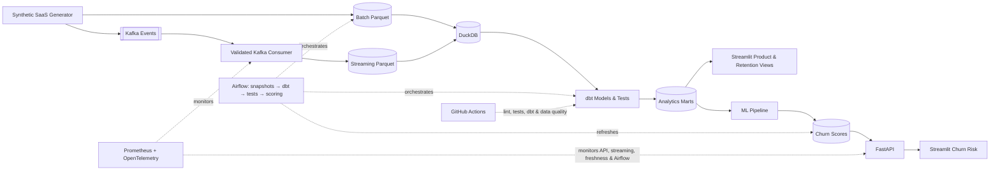
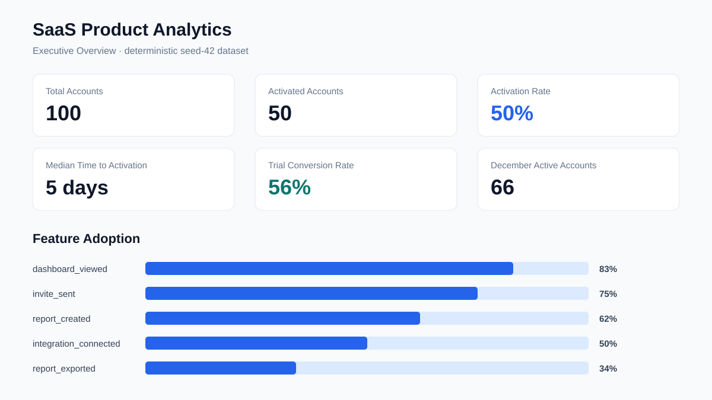
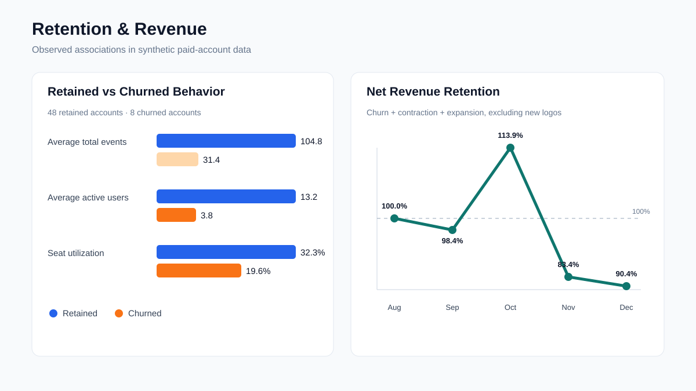
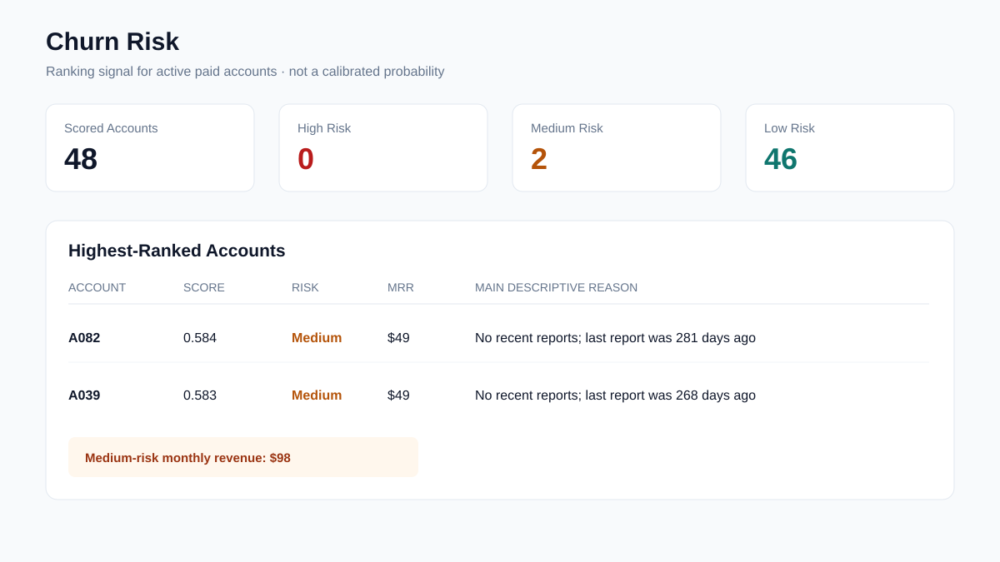
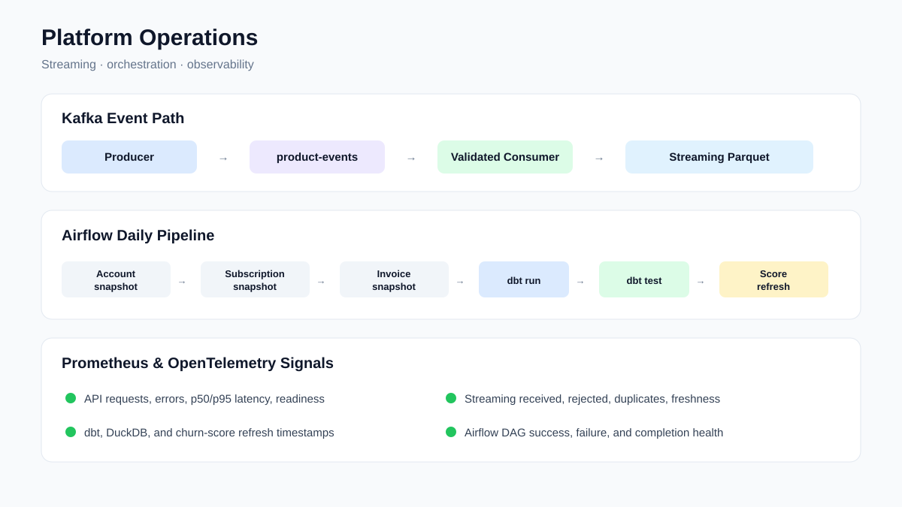
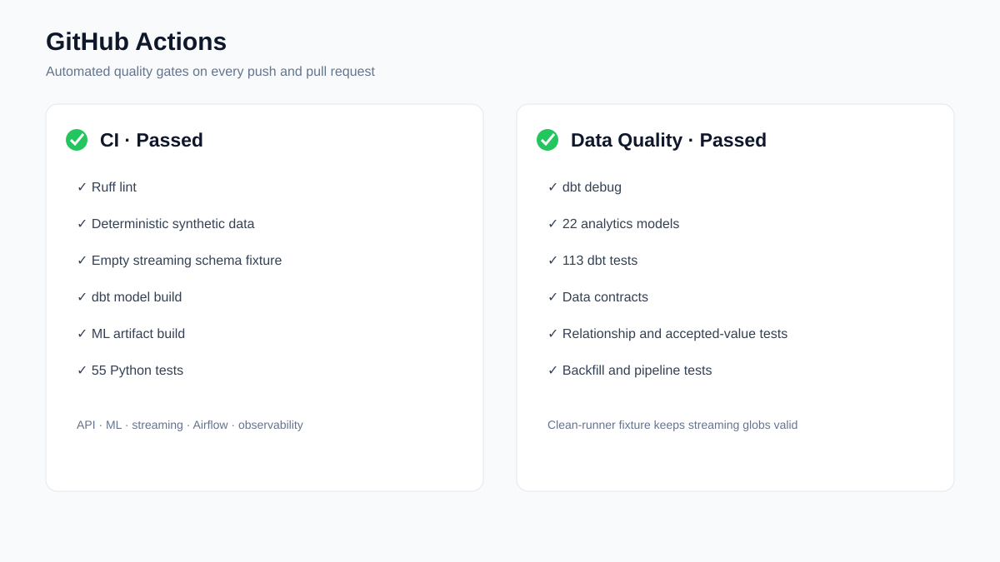

# SaaS Product Analytics, Activation, and Churn Platform

[](https://github.com/keerthi09090/saas-product-analytics-activation-and-churn/actions/workflows/ci.yml)
[](https://github.com/keerthi09090/saas-product-analytics-activation-and-churn/actions/workflows/data_quality.yml)

An end-to-end SaaS analytics platform that combines product-event streaming,
analytics engineering, retention analysis, churn-risk modeling, APIs,
orchestration, observability, and CI/CD.

The project uses a reproducible, behavior-driven **synthetic dataset** so the
entire system can be demonstrated publicly without customer data. It is a
portfolio implementation, not a production deployment at a real company.

[Architecture](#architecture) · [Screenshots](#project-screenshots) ·
[Run locally](#running-locally) · [5-minute demo](docs/demo.md) ·
[Model card](docs/model_card.md) ·
[Retention memo](docs/retention_analysis.md)

## Business Problem

A B2B SaaS company needs a shared view of the customer journey. Teams want to
know:

- Which customers activate successfully, and how long does activation take?
- Which features are adopted and which accounts remain engaged?
- How does retention change over time?
- Which customers churn, and how much recurring revenue is lost?
- Which active customers appear most at risk?
- Which accounts should a retention team investigate first, and why?

This platform brings those questions into one tested analytical system instead
of separate spreadsheets, product logs, billing extracts, and model outputs.

## What This Platform Does

1. Generates realistic SaaS accounts, users, subscriptions, invoices, and events.
2. Calculates activation, adoption, and active-account metrics.
3. Builds typed, tested analytics models with dbt and DuckDB.
4. Presents product analytics in an interactive Streamlit dashboard.
5. Measures cohort retention, logo churn, revenue churn, expansion, and NRR.
6. Trains and evaluates a leakage-aware churn-risk model.
7. Serves account scores and descriptive risk signals through FastAPI.
8. Processes continuously produced product events through Kafka.
9. Orchestrates snapshots, transformations, tests, and scoring with Airflow.
10. Exposes health, freshness, error, latency, and workflow signals.
11. Validates every push and pull request with GitHub Actions.

## Verified Project Results

The deterministic seed-42 batch dataset currently contains 100 accounts:

| Result | Value |
|---|---:|
| Activated accounts | 50 |
| Activation rate | 50% |
| Median time to activation | 5 days |
| Trial conversion rate | 56% |
| Paid accounts retained / churned | 48 / 8 |
| HistGradientBoosting test PR-AUC | 0.173 |
| Relative PR-AUC improvement over logistic baseline | 32.9% |
| Test top-decile lift | 2.15× |
| Python tests | 55 passing |
| dbt tests | 113 passing |

These figures describe a small synthetic demonstration. They are useful for
verifying the system and comparing approaches, not for making real customer
claims.

## Architecture



Kafka handles continuously arriving product events. Airflow handles scheduled
snapshots, transformations, validation, backfills, and score refreshes. They
solve different timing problems and are intentionally kept separate.

## Project Screenshots

The following data-backed portfolio snapshots use the current reproducible
outputs and contain no credentials or private paths.

### Executive Overview and Feature Adoption



### Retention Cohorts, Churn, Revenue, and NRR



### Churn Risk Ranking



### Streaming Status, Airflow DAG, and Prometheus Signals



### GitHub Actions Passing



## Tech Stack

| Technology | Why it is used |
|---|---|
| Python | Synthetic data generation, validation, ML, API, and pipeline logic |
| Parquet | Compact, typed analytical storage for batch and streamed events |
| DuckDB | Lightweight local analytical warehouse with direct Parquet access |
| dbt | Reviewable SQL transformations, tests, lineage, and analytics marts |
| Streamlit | Interactive business-facing product, retention, and risk views |
| scikit-learn | Reproducible baseline and tree-based churn-risk models |
| MLflow | Local experiment parameters, metrics, and artifact tracking |
| FastAPI | Typed, documented access to the latest churn ranking |
| Kafka | Continuous delivery of product events independent of batch snapshots |
| Airflow | Scheduled snapshots, dependency ordering, retries, and backfills |
| Prometheus | Numeric API, streaming, freshness, and workflow health metrics |
| OpenTelemetry | Request instrumentation and trace correlation |
| Docker Compose | Repeatable local Kafka, Airflow, API, and monitoring services |
| GitHub Actions | Automated lint, test, dbt, and data-quality gates |

Each tool has one explicit responsibility; the architecture is not intended as
a technology-count exercise.

## Data Model

The five source entities are:

- **accounts** — company profile, plan, seats, channel, and synthetic engagement state;
- **users** — product users and roles belonging to valid accounts;
- **subscriptions** — trials, paid starts, status, price, and cancellation date;
- **invoices** — historical billing periods and payment outcomes; and
- **product events** — timestamped workspace, invitation, integration, report,
  dashboard, and login behavior.

dbt types and cleans these sources in `stg_accounts`, `stg_users`, `stg_events`,
`stg_subscriptions`, and `stg_invoices`. `dim_account`, `dim_user`,
`fact_product_events`, and `fact_subscriptions` provide reusable analytical
entities. Business outputs include `mart_activation`, `mart_feature_adoption`,
`mart_retention_cohorts`, `mart_logo_churn`, `mart_revenue_churn`, and
`mart_revenue_retention`.

## Key Metrics

| Metric | Definition |
|---|---|
| Activation Rate | Accounts completing workspace creation, an invitation, and an integration connection within 14 days of trial start ÷ trial accounts |
| Median Time to Activation | Median days from trial start until the final required activation milestone |
| Feature Adoption | Accounts using a feature at least once ÷ eligible accounts |
| Weekly Active Accounts | Unique accounts with at least one product event in a calendar week |
| Monthly Active Accounts | Unique accounts with at least one product event in a calendar month |
| Trial Conversion | Accounts that became paid subscriptions ÷ trial accounts |
| Retention | Share of a signup cohort active in a later week |
| Logo Churn | Paid accounts cancelled during a month ÷ paid accounts at month start |
| Revenue Churn | MRR lost from cancellations ÷ starting MRR |
| Expansion MRR | Additional recurring revenue from upgrades among existing customers |
| Net Revenue Retention | `(starting MRR − churn − contraction + expansion) ÷ starting MRR` |
| Churn Risk Score | Model output used to rank active paid accounts for review |

Churn risk scores are ranking signals and are **not claimed to be perfectly
calibrated churn probabilities**.

## Churn Risk Modeling

Monthly prediction snapshots ask whether an eligible active paid account will
cancel in the next 30 days. Features are cut off at each prediction date to
avoid using future activity or billing information.

- **Baseline:** Logistic Regression
- **Selected tree model:** HistGradientBoosting
- **Signals:** recent event frequency, activity decline, recency, adoption,
  seat utilization, billing/payment history, activation, and account attributes
- **Evaluation:** PR-AUC, ROC-AUC, precision, recall, F1, and top-10% lift

On the held-out December test month, the tree model reached PR-AUC 0.173 versus
0.130 for logistic regression—a 32.9% relative improvement—and 2.15×
top-decile lift. The absolute sample is small: 107 account-month observations
and eight churn labels. See the [model card](docs/model_card.md) for the split,
limitations, and intended human-review use.

## Data Quality and Reliability

The platform validates unique IDs, accepted values, foreign-key relationships,
account/user ownership, event schema versions, invalid and duplicate events,
chronology, nonnegative revenue, dbt business rules, and backfill idempotency.

The latest verified suite has **113 passing dbt tests** and **55 passing Python
tests**. The synthetic generator uses a fixed seed, allowing analytical outputs
to be checked against known generation rules.

## Real-Time Event Streaming

The producer publishes finite demonstrations of product events to Kafka. The
consumer validates account/user relationships, accepts schema v1 and v2,
rejects malformed events without crashing, ignores duplicate event IDs, and
writes valid batches to Parquet for the dbt event model.

The local dashboard freshness goal is **under five minutes**. This is a
portfolio development target, not a production SLA. The event schema and
failure behavior are documented in [the event contract](docs/event_contract.md).

## Orchestration and Backfills

Airflow schedules account, subscription, and invoice snapshots, followed by
`dbt run`, `dbt test`, and churn-score refresh. A failing data-quality step
blocks scoring. Historical logical dates can be rebuilt safely: rerunning the
same date atomically replaces the same partition instead of duplicating rows.

## Churn Risk API

FastAPI loads the latest score artifact once at startup and never retrains the
model during a request.

| Endpoint | Purpose |
|---|---|
| `GET /health` | Service and score-artifact health |
| `GET /ready` | Readiness for serving churn routes |
| `GET /v1/churn/{account_id}` | One account's score and descriptive reasons |
| `GET /v1/churn` | Descending risk ranking with filters and limit |
| `GET /v1/churn/summary` | Bucket counts and high-risk monthly revenue |
| `GET /metrics` | Prometheus metrics |

FastAPI also generates interactive documentation at `/docs` and `/redoc`.

```json
{
  "account_id": "A082",
  "churn_score": 0.583972,
  "risk_bucket": "Medium",
  "prediction_date": "2026-09-25",
  "monthly_revenue": 49.0,
  "top_reasons": [
    "no recent reports; last report was 281 days ago",
    "no integration was connected",
    "one or fewer active users in the last 30 days"
  ]
}
```

More examples are in [docs/api.md](docs/api.md).

## Observability

- **FastAPI:** request count, errors, normalized routes, latency histograms,
  readiness, and trace IDs;
- **Kafka:** received, persisted, rejected, and duplicate event counts plus
  latest-event freshness;
- **Analytics:** dbt success, DuckDB refresh, and score-artifact timestamps; and
- **Airflow:** latest DAG success, failure, and completion state.

A verified local development run sent 200 measured API requests with zero
errors, p50 latency of approximately **1.89 ms**, and p95 of approximately
**2.64 ms**. This tiny in-memory, loopback benchmark is not a production SLA.
See [docs/observability.md](docs/observability.md).

## CI/CD and Automated Quality Gates

Every push and pull request to `main` runs Ruff, deterministic data setup,
Python tests, dbt models, dbt tests, data-contract checks, API tests, ML tests,
streaming tests, Airflow pipeline tests, and observability tests. The streaming
fixture script creates a zero-row, schema-correct Parquet file on clean runners
without committing generated Kafka data.

The **CI** and **Data Quality** workflows currently pass. Workflow intent and
failure interpretation are in [docs/ci_cd.md](docs/ci_cd.md).

## Project Story

**Problem:** A B2B SaaS company needs a unified view of activation, adoption,
retention, recurring revenue, and churn risk.

**Approach:** Build one local analytical platform combining realistic batch and
streaming inputs, tested transformations, dashboards, time-aware ML scoring,
an API, orchestration, monitoring, and CI.

**Outcome:** The system surfaces activation bottlenecks, feature adoption,
retention patterns, revenue movement, and a reasoned queue of accounts for
human review. All outcomes come from synthetic data and demonstrate engineering
and analytical methods rather than real-company performance.

## Running Locally

```bash
git clone https://github.com/keerthi09090/saas-product-analytics-activation-and-churn.git
cd saas-product-analytics-activation-and-churn
python3 -m venv .venv
source .venv/bin/activate
python -m pip install -r requirements.txt

python -m simulator.generate
cd analytics_dbt
dbt run --profiles-dir .
dbt test --profiles-dir .
cd ..

# Optional multi-service stack: Docker Desktop must be running.
cp .env.example .env
docker compose up -d --build

# If running the apps directly instead of their containers:
uvicorn api.main:app --reload
streamlit run dashboard/app.py
```

The dashboard is at `http://localhost:8501`, API docs at
`http://localhost:8000/docs`, Airflow at `http://localhost:8080`, and
Prometheus at `http://localhost:9090`. See
[docs/local_setup.md](docs/local_setup.md) for prerequisites, terminal layout,
Kafka, MLflow, shutdown, and troubleshooting.

## Repository Structure

```text
api/                 FastAPI churn-risk service
airflow/             Daily and historical backfill DAGs
analytics_dbt/       Staging, intermediate, fact, dimension, and mart models
dashboard/           Streamlit product, retention, and churn-risk views
docs/                Contracts, setup, demo, model, analysis, and operations docs
ml/                  Leakage-aware dataset, training, evaluation, and scoring
monitoring/          Prometheus configuration and queries
pipelines/           Idempotent snapshots and score refresh commands
simulator/           Deterministic synthetic SaaS data generator
streaming/           Kafka producer, validated consumer, schema, and metrics
tests/               Unit, integration, data, API, ML, and pipeline tests
.github/workflows/   CI and Data Quality workflows
```

## Documentation

- [Local setup](docs/local_setup.md)
- [5-minute demo guide](docs/demo.md)
- [Retention analysis](docs/retention_analysis.md)
- [Churn model card](docs/model_card.md)
- [Event contract](docs/event_contract.md)
- [API reference](docs/api.md)
- [Observability guide](docs/observability.md)
- [CI/CD guide](docs/ci_cd.md)

## Assumptions and Responsible Use

The generator encodes plan, company size, seat, engagement, billing, and
product-usage relationships. Those rules deliberately create realistic-looking
associations, so analytical and model results partly recover simulator design.
No causal claims should be drawn. The risk ranking supports investigation; it
must not automatically contact customers, change pricing, or make account
decisions.
